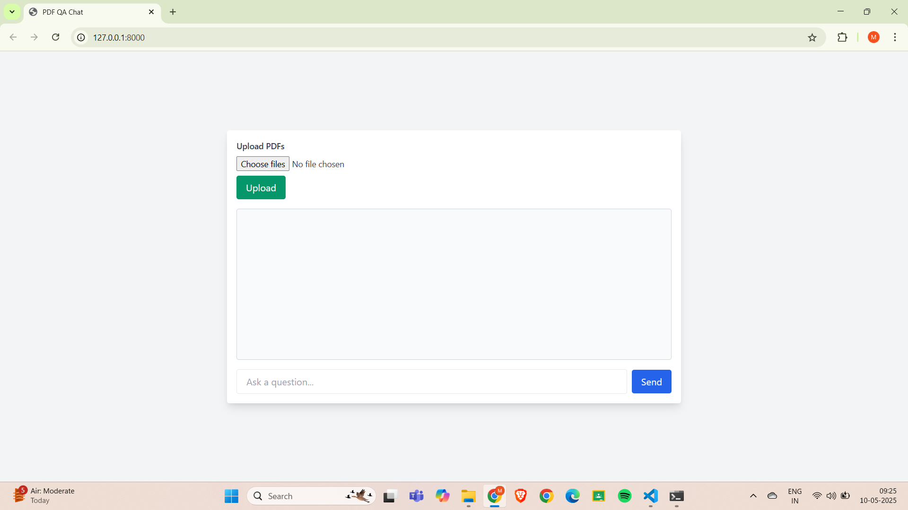
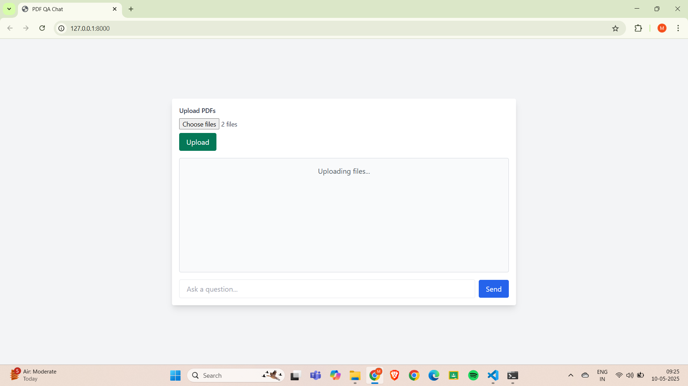
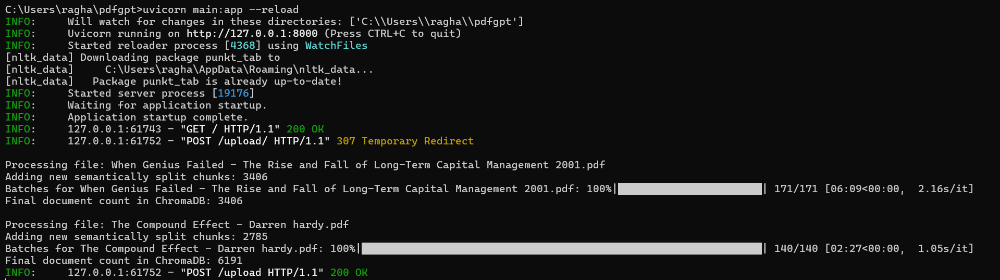
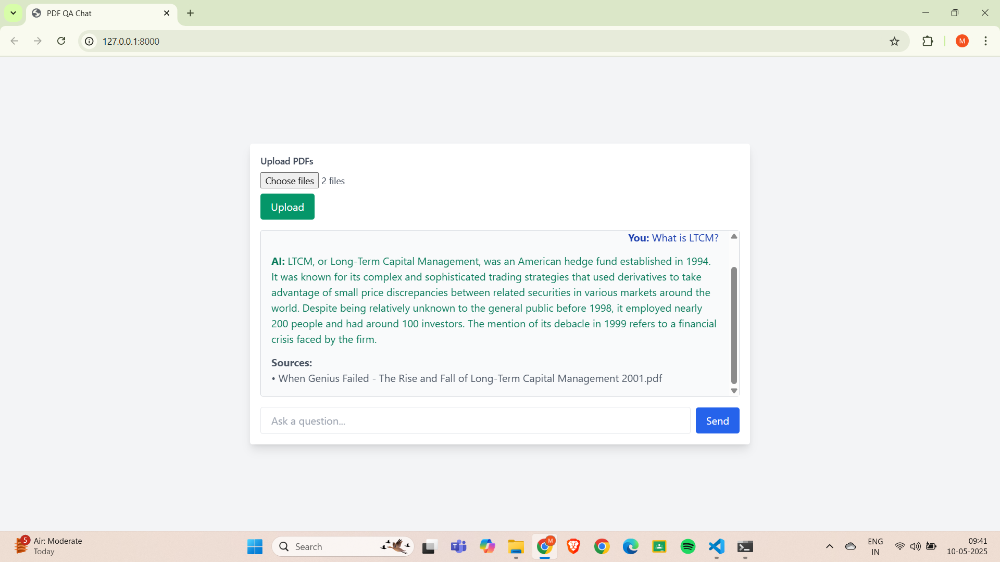

# PDF QA Chat App

A web-based application that lets you upload PDF files and ask questions about their content. The app semantically chunks your PDFs, embeds them using advanced language models, and retrieves relevant information to answer your queries in natural language.

---

## Features

- Upload and process multiple PDF files.
- Semantic chunking for improved context understanding.
- Embedding and retrieval using Ollama models and Chroma vector database.
- Natural language answers generated by a language model.
- Source referencing for each answer.

---

## Tech Stack

- **Backend:** FastAPI, LangChain, Ollama, Chroma, NLTK, scikit-learn
- **Frontend:** HTML, JavaScript
- **Other:** TQDM (progress), Static file serving

---

## Screenshots

### Chat Interface


### Uploading a PDF


### Batchwise Upload of Chunks to ChromaDB


### Sample Answer with Source


---

## Running Ollama Model Server Locally

This project relies on Ollama to serve both the language model (e.g., `mistral`) and the embedding model (e.g., `nomic-embed-text`) locally. Follow these steps to set up and run the Ollama Models:

### 1. Install Ollama

Download and install Ollama from the [official website](https://ollama.com/) or use the following command for Linux:

```
curl -fsSL https://ollama.com/install.sh | sh
```

Verify the installation:
```
ollama --version
```

### 2. Download the Required Models

Pull the language and embedding models you need. For example:
```
ollama pull mistral
ollama pull nomic-embed-text
```

---

## Getting Started

### Prerequisites

- Python 3.8+
- `git`
- (Recommended) Virtual environment tool (`venv` or `conda`)

### Installation

1. **Clone the repository**
```
git clone <repository-url>
cd <repository-folder>
```

2. **Set up a virtual environment**

```
python -m venv venv
source venv/bin/activate # On Windows: venv\Scripts\activate
```

3. **Install dependencies**

```
pip install -r requirements.txt
```

If `requirements.txt` is missing, install manually:
```
pip install fastapi uvicorn langchain langchain-ollama langchain-chroma langchain-community nltk scikit-learn tqdm
```

4. **Download NLTK data**

```
python -c "import nltk; nltk.download('punkt_tab')"
```

5. **Run the FastAPI server**
```
uvicorn main:app --reload
```
6. **Access the app**

Open your browser and go to:
```
http://localhost:8000/
```

---

## Usage

- Click **Upload PDFs** to select and upload one or more PDF files.
- Once uploaded, enter your question in the chat box and click **Send**.
- The app will process your query and display an answer, along with source information from the PDFs.

---

## Project Structure

| File/Folder   | Purpose                                              |
|---------------|------------------------------------------------------|
| `main.py`     | FastAPI backend: file upload, PDF processing, QA API |
| `index.html`  | Frontend UI for upload and chat                      |
| `script.js`   | Frontend logic for uploads and chat                  |
| `uploads/`    | Stores uploaded PDF files                            |
| `chroma/`     | Stores vector embeddings (Chroma DB)                 |
| `static/`     | Static files (frontend assets)                       |

---

## Notes

- Uses Ollama's `nomic-embed-text` for embeddings and `mistral` for LLM.
- Semantic chunking splits PDF text based on sentence similarity.
- Chroma vector store is used for fast similarity search.
- Make sure Ollama models are available and configured in your environment.

---

## Contributing

Feel free to open issues or submit pull requests!

---


